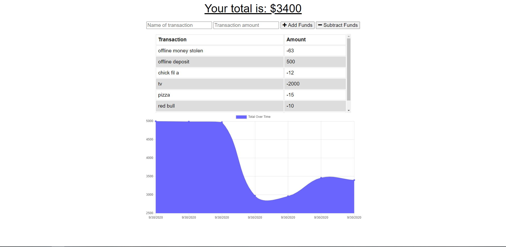

# Budget-Tracker

# Description

An application that keeps track of the users money and will keep track even in offline mode and when the user is able to connect back online the users budget is updated to show the offline transactions

# Table of Contents

* [Process](#Process)
* [Issues](#Issues)
* [Link](#Link)
* [Screenshot](#Screenshot)

# Process

First you need to add funds by entering the name of the transaction and the amount value in dollars

and clicking add funds button.

Next you can test the subtract feature by entering the name and value again and pressing the subtract funds.

Next right click on the webpage and click on inspect.

Next click on the network tab at the top of the new screen.

Next where it says online click on it and choose offline.

Next test the budget tracker offline by adding or subtracting funds. 

Next click back online and update page and this will show the transaction you made offline.

# Issues

Alot of the code was provided in class work and made alot of easy work copying and pasting boiler plate code.

Issues came from trying to deploy on heroku.

Found out in class from another student that we had to create a whole new js file for the db to work in offline mode and save from the cache.

if not addin this file the code will not work in heroku.

Next my app would crash in offline mode and had to re arrange code and found typo errors causing this issue.

# Link

[Link to Heroku site](https://my-checkbook.herokuapp.com/)

# Screenshot

